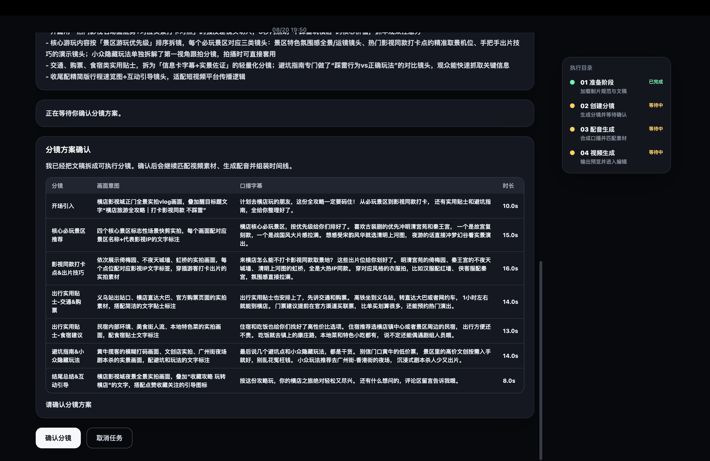
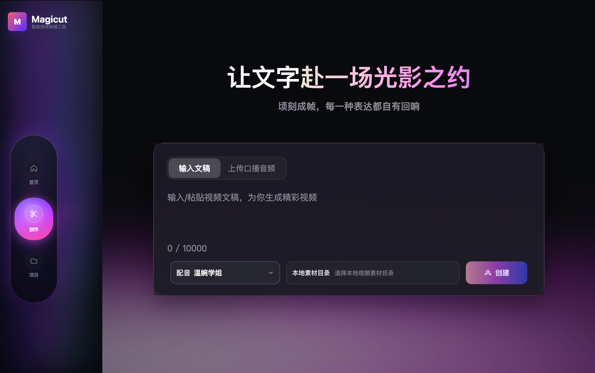
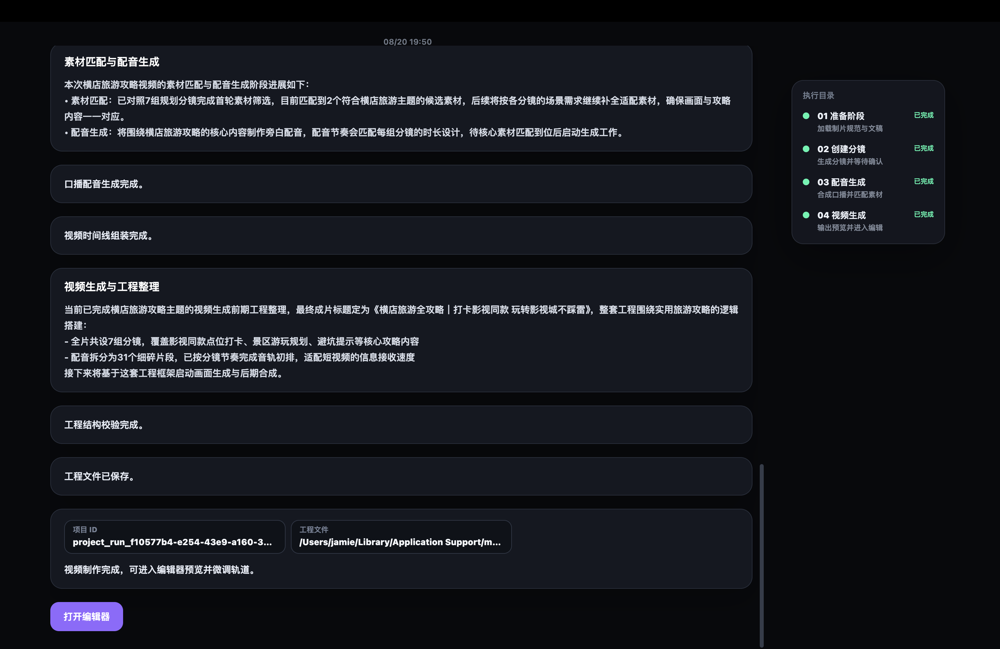
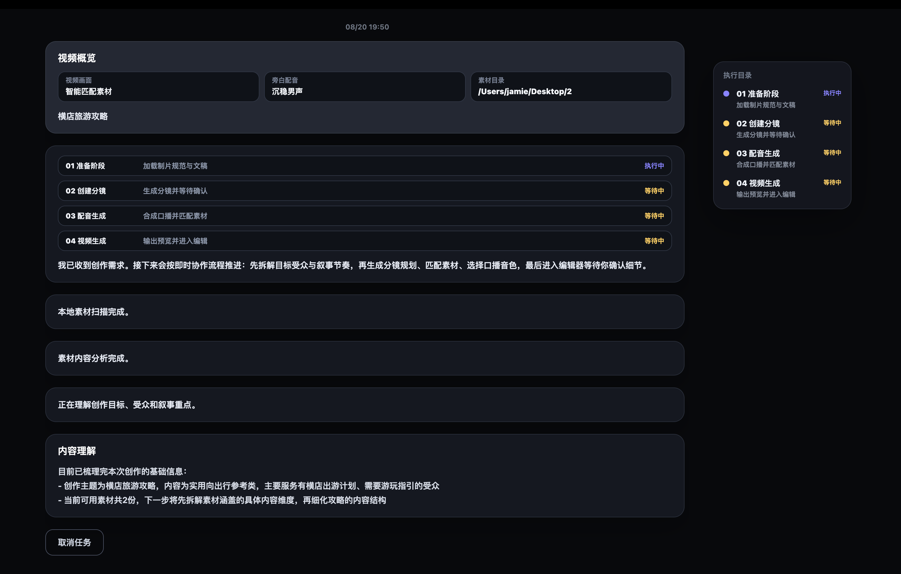
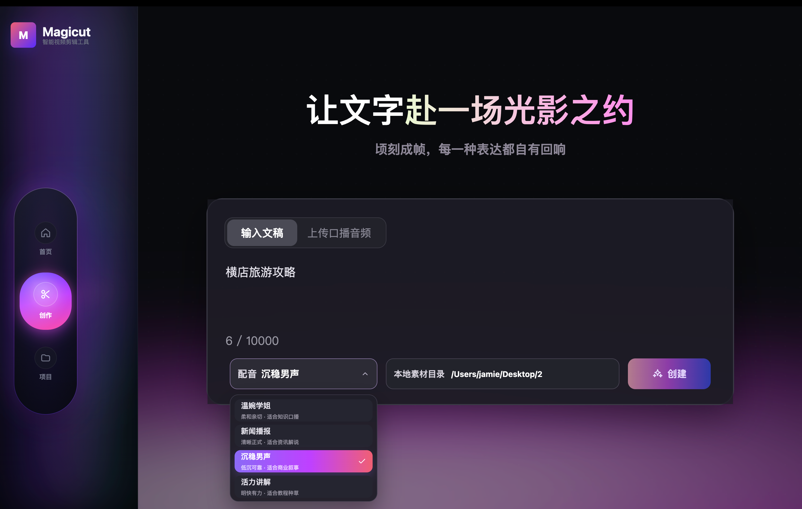

# Magicut

**English** | [简体中文](#简体中文)

Magicut is a personal Vibe Coding practice project for a vertical AI video-editing Agent in the short-form video creation domain. It uses a Vue 3 + Electron desktop architecture to explore how AI coding assistants can participate in the full cycle of building a complex product prototype, from requirements and UI iteration to agent workflow, media handling, testing, and release-oriented engineering.

The product direction is an AI-powered desktop video editing workflow: users provide a script, choose a voice, select a local media folder, and let the video creation Agent scan assets, plan scenes, match footage, generate narration, organize subtitles, and produce a video project that can continue to be edited.

## Screenshots

| Screenshot 01                                                           | Screenshot 02                                                           | Screenshot 03                                                           |
| ----------------------------------------------------------------------- | ----------------------------------------------------------------------- | ----------------------------------------------------------------------- |
|  |  |  |
| Screenshot 04                                                           | Screenshot 05                                                           | Screenshot 06                                                           |
|  |  |  |
| Screenshot 07                                                           | Screenshot 08                                                           | Screenshot 09                                                           |
|  |  |  |

## What It Does

Current capabilities:

- pnpm monorepo with desktop, server, agent, and video project packages.
- Electron Forge + Vite + Vue 3 desktop app.
- Nuxt/Nitro server app kept as the Vue-ecosystem server placeholder.
- `@magicut/video-project` for video project schemas, fixtures, and validation.
- `@magicut/video-agent` for the video creation Agent, model provider, TTS provider, asset scanning, and workflow nodes.
- Create page, workspace project list, independent Agent run page, and editor foundation.
- Local media folder selection through the system folder picker.
- Local video scanning, asset matching, scene planning, TTS narration generation, and project persistence.
- Agent run page at `/create/runs/:runId` for progress display, scene confirmation, cancellation, and editor entry after completion.
- Agent run events, streamed stage reports, and persisted `ai.conversation` history in the generated video project.
- `magicut-media://` protocol for loading local video, thumbnails, and generated narration inside Electron.
- H.264 preview proxy generation for local HEVC/H.265, 10-bit, and `.MOV` sources that may not preview reliably in Electron Chromium.
- Editor preview with real media, play/pause, subtitle overlay, timeline playhead, scene highlighting, and basic export dialog.

Current limitations:

- Final video composition and export have a working foundation, but still need broader validation with real projects, media formats, and cross-platform packaging.
- Some advanced editor operations are still UI or state foundations and are not fully wired to real editing behavior.
- Agent output still needs more validation across real media libraries, LLM providers, and TTS providers.
- The create page shows an uploaded narration audio entry, but the main flow currently focuses on script input.
- The Nuxt server is currently a placeholder and is not required by the main desktop workflow yet.

## Tech Stack

### Workspace

- Monorepo: pnpm workspace with `apps/*` and `packages/*`.
- Package manager: pnpm only.
- Language: TypeScript.
- Quality tools: ESLint, Prettier, Vitest, cspell, commitlint, Commitizen.
- Collaboration rules: root `AGENTS.md`.

### Desktop App

- App: `apps/desktop`.
- Runtime: Electron `38.4.0`.
- Desktop toolchain: Electron Forge `7.10.2`.
- Build tool: Vite `7.1.12` + `@vitejs/plugin-vue` `6.0.1`.
- Frontend: Vue `3.5.22` + Vue Router `4.5.1`.
- Routing: Vue Router with `createWebHashHistory()` for Electron local routes.
- Styling: Tailwind CSS `4.1.x` with the Tailwind v4 CSS-first setup and `@tailwindcss/vite`.
- State management: no Pinia or Vuex yet. The current app mainly uses Vue Composition API state (`shallowRef`, `computed`, `watch`) plus a small hand-written store for Agent run state.
- IPC and local files: Electron main/preload expose file dialogs, video project read/write, custom voice import, export path selection, and media utilities.
- Media tooling: bundled FFmpeg/FFprobe for probing media, resolving narration duration, generating preview proxies, and exporting.

### Agent And Project Data

- Agent package: `packages/video-agent`.
- Agent workflow: LangGraph.js, LangChain OpenAI-compatible provider, Zod, dotenv, ws.
- Project schema package: `packages/video-project`.
- Validation: Zod schemas protect Agent output, run events, and video project data consumed by the desktop UI.

### Server

- App: `apps/server`.
- Stack: Nuxt `4` with Nitro server routes.
- Current role: Vue-ecosystem server placeholder. It currently provides a placeholder app page and a health check endpoint. The desktop workflow does not depend on it yet.

## Project Structure

```text
.
├── apps
│   ├── desktop          # Electron Forge + Vite + Vue 3 desktop app
│   └── server           # Nuxt/Nitro server placeholder
├── packages
│   ├── video-agent      # Video creation Agent, model/TTS providers, workflow nodes
│   └── video-project    # Video project schemas, fixtures, validation
├── .codex/skills        # Codex skills used by this project
├── AGENTS.md            # Agent collaboration constraints
├── pnpm-workspace.yaml
└── package.json
```

## Requirements

### Node And pnpm

- Node.js: `>=22 <23`.
- The repo pins Node `22.20.0` through `.nvmrc`, `.node-version`, `.tool-versions`, and the `package.json` Volta field.
- pnpm: `11.4.0`, pinned by `packageManager` and Volta.
- Use pnpm only. Do not mix npm or yarn in this workspace.

Common version switching options:

```bash
# nvm
nvm use

# fnm
fnm use

# mise or asdf
mise install
mise use

# Volta switches automatically when entering the project
node -v
pnpm -v
```

### Local Media

- The create flow expects a folder, not a single video file.
- Video files may look disabled in the macOS folder picker because the picker is selecting the parent folder.
- Supported scanned video extensions: `.mp4`, `.mov`, `.m4v`, `.webm` (case-insensitive).
- Only the first level of the selected folder is scanned for now; nested folders are not scanned recursively.
- The current system user must have read permission for the selected folder.
- Generated projects load videos, thumbnails, and narration through `magicut-media://`.
- iPhone HEVC/H.265, 10-bit, and `.MOV` sources may show a black preview in Electron Chromium. Magicut generates H.264/yuv420p `.mp4` preview proxies for editor playback without modifying the original files.
- Existing old projects are not rewritten automatically. Recreate the project if an old HEVC/MOV project still previews as black.

### LLM And TTS Configuration

Real Agent generation requires LLM and TTS credentials. The desktop app can start without them, but scene planning, narration, and the full Agent workflow will not run correctly until they are configured.

Create a local environment file from `.env.example`. The desktop app checks `.env.local`, `.env`, then `env` from the repo root.

```bash
LLM_MODEL=your-llm-model
TTS_MODEL=your-tts-model
BASE_URL=https://your-model-provider.example.com/api
API_KEY=your-local-api-key
```

Do not commit real keys.

## Installation

```bash
pnpm i
```

Start the desktop app:

```bash
pnpm start
```

Equivalent desktop command:

```bash
pnpm dev:desktop
```

Start the server placeholder:

```bash
pnpm dev:server
```

## Common Commands

```bash
# Desktop development
pnpm start

# All tests
pnpm test:run

# All lint checks
pnpm lint

# Formatting check
pnpm exec prettier --check .

# Package desktop app
pnpm package

# Build installers
pnpm make
```

Desktop-only commands:

```bash
pnpm --filter @magicut/desktop test:run
pnpm --filter @magicut/desktop lint
pnpm --filter @magicut/desktop package:mac
pnpm --filter @magicut/desktop package:win
```

Core package commands:

```bash
pnpm --filter @magicut/video-agent test:run
pnpm --filter @magicut/video-agent typecheck
pnpm --filter @magicut/video-project test:run
pnpm --filter @magicut/video-project typecheck
```

## Basic Workflow

1. Start the desktop app.
2. Enter or paste a video script.
3. Choose a narration voice.
4. Click the local media folder selector and choose the folder that contains video assets.
5. Create the project and wait for the Agent to scan assets, plan scenes, match footage, generate narration, and save the project.
6. Confirm scenes when the run page asks for confirmation.
7. Open the generated project in the editor.
8. Preview real footage, subtitles, narration, and timeline tracks.

If the local folder cannot be read, check that:

- You selected a folder, not a single video.
- The folder exists and the current user can read it.
- The video files are directly inside the selected folder.
- The folder contains `.mp4`, `.mov`, `.m4v`, or `.webm` files.

## Git And Commits

This project uses commitlint and Commitizen. Validate a commit message before committing:

```bash
printf 'feat: add something\n' | pnpm exec commitlint
```

Commit through Commitizen:

```bash
pnpm commit
```

Use Conventional Commits, for example:

- `feat: add project preview`
- `fix: repair electron install check`
- `docs: update readme`

## Development Notes

- Use pnpm only.
- Commit dependency changes with `pnpm-lock.yaml`.
- Do not commit `node_modules`, local caches, real secrets, or temporary files.
- Prefer focused changes that match existing project patterns.
- For code changes, run relevant checks:

```bash
pnpm -r --if-present run lint
pnpm -r --if-present run test:run
pnpm exec prettier --check .
```

Do not use `pnpm -r --if-present run format` as a pure verification command because it rewrites files.

---

## 简体中文

[English](#magicut) | **简体中文**

Magicut 是一个个人 Vibe Coding 实践项目，面向短视频创作这一垂直场景，探索以视频创作 Agent 为核心的 AI 智能剪辑桌面应用。项目基于 Vue 3 生态 + Electron 桌面端架构，重点验证 AI 编程助手如何参与复杂产品原型开发的完整流程，包括需求拆解、界面迭代、智能体流程、媒体处理、测试验证和工程化交付。

产品方向是一条 AI 驱动的桌面端视频剪辑工作流：用户输入文稿、选择配音音色、选择本地素材目录后，由视频创作 Agent 扫描素材、规划分镜、匹配素材、生成口播配音、组织字幕和时间线，最终生成可继续编辑的视频工程。

## 项目截图

| 截图 01                                                           | 截图 02                                                           | 截图 03                                                           |
| ----------------------------------------------------------------- | ----------------------------------------------------------------- | ----------------------------------------------------------------- |
|  |  |  |
| 截图 04                                                           | 截图 05                                                           | 截图 06                                                           |
|  |  |  |
| 截图 07                                                           | 截图 08                                                           | 截图 09                                                           |
|  |  |  |

## 项目能力

当前已经具备的能力：

- pnpm monorepo 工程结构，包含桌面端、服务端占位、Agent 包和视频工程数据包。
- Electron Forge + Vite + Vue 3 桌面端。
- Nuxt/Nitro 服务端应用，作为 Vue 生态服务端占位。
- `@magicut/video-project` 视频工程 schema、fixture 和校验逻辑。
- `@magicut/video-agent` 视频创作 Agent、模型 provider、TTS provider、素材扫描和流程节点。
- 创建页、工作台项目列表、独立 Agent 运行页和编辑器基础界面。
- 通过系统文件夹选择器选择本地素材目录。
- 本地视频素材扫描、素材匹配、分镜规划、TTS 配音生成和工程持久化。
- 独立智能体运行页 `/create/runs/:runId`，用于展示创建过程、分镜确认、取消任务和完成后的编辑器入口。
- Agent 运行事件、阶段流式报告，以及写入视频工程的 `ai.conversation` 会话记录。
- `magicut-media://` 本地媒体协议，用于在 Electron 中加载视频、缩略图和配音文件。
- 对 Electron Chromium 预览不稳定的 HEVC/H.265、10-bit、`.MOV` 素材自动生成 H.264 预览代理。
- 编辑器内真实素材预览、播放/暂停、字幕浮层、时间线播放头、分镜高亮和基础导出弹窗。

当前限制：

- 视频最终合成与导出能力已有基础链路，但仍需要更多真实工程、素材格式和跨平台场景验证。
- 编辑器内部分高级操作仍是界面或基础状态，尚未全部接入真实编辑行为。
- Agent 生成结果仍需要更多真实素材、模型和 TTS 场景验证。
- 创建页的“上传口播音频”目前是入口展示，主流程仍以输入文稿为主。
- Nuxt 服务端当前是占位工程，尚未作为桌面端主流程依赖。

## 技术栈

### 工程与包管理

- Monorepo：pnpm workspace，工作区包含 `apps/*` 和 `packages/*`。
- 包管理：只使用 pnpm。
- 开发语言：TypeScript。
- 质量工具：ESLint、Prettier、Vitest、cspell、commitlint、Commitizen。
- 协作规范：根目录 `AGENTS.md`。

### 桌面端

- 应用位置：`apps/desktop`。
- 桌面运行时：Electron `38.4.0`。
- 桌面工程：Electron Forge `7.10.2`。
- 构建工具：Vite `7.1.12` + `@vitejs/plugin-vue` `6.0.1`。
- 前端框架：Vue `3.5.22` + Vue Router `4.5.1`。
- 路由方案：Vue Router + `createWebHashHistory()`，适配 Electron 本地路由。
- 样式方案：Tailwind CSS `4.1.x`，使用 Tailwind v4 CSS-first 入口和 `@tailwindcss/vite`。
- 状态管理：当前没有引入 Pinia 或 Vuex，主要使用 Vue Composition API 的 `shallowRef`、`computed`、`watch`，以及少量手写轻量 store。
- IPC 与本地文件：通过 Electron main/preload 暴露文件夹选择、视频工程读写、自定义音色导入、导出路径选择和媒体工具。
- 本地媒体处理：内置 FFmpeg/FFprobe，用于媒体探测、配音时长解析、预览代理生成和导出。

### 智能体与工程数据

- Agent 包：`packages/video-agent`。
- Agent 技术：LangGraph.js、LangChain OpenAI-compatible provider、Zod、dotenv、ws。
- 工程数据包：`packages/video-project`。
- 数据校验：使用 Zod 约束 Agent 输出、运行事件和桌面端消费的视频工程数据。

### 服务端

- 应用位置：`apps/server`。
- 技术栈：Nuxt `4` + Nitro server routes。
- 当前角色：Vue 生态服务端占位工程，目前提供占位页面和健康检查接口，桌面端主流程暂不依赖它。

## 目录结构

```text
.
├── apps
│   ├── desktop          # Electron Forge + Vite + Vue 3 桌面端
│   └── server           # Nuxt/Nitro 服务端占位
├── packages
│   ├── video-agent      # 视频创作 Agent、模型/TTS provider、流程节点
│   └── video-project    # 视频工程 schema、fixture、校验
├── .codex/skills        # 当前项目使用的 Codex skills
├── AGENTS.md            # 项目内 Agent 协作约束
├── pnpm-workspace.yaml
└── package.json
```

## 环境要求

### Node 与 pnpm

- Node.js：`>=22 <23`。
- 当前仓库通过 `.nvmrc`、`.node-version`、`.tool-versions` 和 `package.json` 的 Volta 字段统一固定到 Node `22.20.0`。
- pnpm：`11.4.0`，通过 `packageManager` 和 Volta 固定。
- 本项目只使用 pnpm，不混用 npm 或 yarn。

常见 Node 自动切换方式：

```bash
# nvm
nvm use

# fnm
fnm use

# mise 或 asdf
mise install
mise use

# Volta 进入项目后自动切换
node -v
pnpm -v
```

### 本地素材

- 创建流程需要选择素材文件夹，而不是单个视频文件。
- 在 macOS 文件夹选择弹窗中，视频文件显示为置灰是正常现象，因为当前选择目标是外层文件夹。
- 支持扫描的视频后缀：`.mp4`、`.mov`、`.m4v`、`.webm`，大小写不敏感。
- 当前只扫描所选目录第一层文件，暂不递归扫描子目录。
- Electron 需要当前系统用户具备该目录读取权限。
- 生成后的工程会通过 `magicut-media://` 协议读取视频、缩略图和配音文件。
- iPhone 常见的 HEVC/H.265、10-bit、`.MOV` 原片可能在 Electron Chromium 中黑屏。Magicut 会自动生成 H.264/yuv420p 的 `.mp4` 预览代理用于编辑器播放，同时不会修改原始素材。
- 已生成过的旧工程不会自动改写素材路径。如果旧工程仍然遇到 HEVC/MOV 黑屏，请重新走一次创建流程生成新工程。

### LLM 与 TTS 配置

完整智能创作流程依赖真实 LLM 和 TTS 服务。桌面端可以在未配置时启动，但分镜规划、口播配音和完整 Agent 链路需要配置后才能正常跑通。

请基于 `.env.example` 创建本地环境文件。桌面端启动时会按顺序查找根目录下的 `.env.local`、`.env`、`env`。

```bash
LLM_MODEL=your-llm-model
TTS_MODEL=your-tts-model
BASE_URL=https://your-model-provider.example.com/api
API_KEY=your-local-api-key
```

不要提交真实密钥。

## 安装

```bash
pnpm i
```

启动桌面端：

```bash
pnpm start
```

等价桌面端命令：

```bash
pnpm dev:desktop
```

启动服务端占位应用：

```bash
pnpm dev:server
```

## 常用命令

```bash
# 桌面端开发
pnpm start

# 运行全部测试
pnpm test:run

# 运行全部 lint
pnpm lint

# 检查格式
pnpm exec prettier --check .

# 打包桌面端
pnpm package

# 生成安装产物
pnpm make
```

桌面端单包命令：

```bash
pnpm --filter @magicut/desktop test:run
pnpm --filter @magicut/desktop lint
pnpm --filter @magicut/desktop package:mac
pnpm --filter @magicut/desktop package:win
```

核心包命令：

```bash
pnpm --filter @magicut/video-agent test:run
pnpm --filter @magicut/video-agent typecheck
pnpm --filter @magicut/video-project test:run
pnpm --filter @magicut/video-project typecheck
```

## 基础使用流程

1. 启动桌面端应用。
2. 输入或粘贴视频文稿。
3. 选择配音音色。
4. 点击本地素材目录选择器，选择包含视频素材的文件夹。
5. 点击创建，等待 Agent 扫描素材、规划分镜、匹配素材、生成配音并保存工程。
6. 在运行页按提示确认分镜。
7. 打开生成的视频工程。
8. 在编辑器中预览真实素材、字幕、配音和时间线轨道。

如果本地素材目录无法读取，请优先确认：

- 选择的是素材文件夹，不是单个视频文件。
- 目录存在，并且当前系统用户有读取权限。
- 视频文件直接放在所选目录第一层。
- 目录内包含 `.mp4`、`.mov`、`.m4v` 或 `.webm` 视频文件。

## Git 与提交

本项目使用 commitlint 和 Commitizen。提交前建议先检查提交信息：

```bash
printf 'feat: add something\n' | pnpm exec commitlint
```

正式提交使用：

```bash
pnpm commit
```

提交信息使用 Conventional Commits，例如：

- `feat: add project preview`
- `fix: repair electron install check`
- `docs: update readme`

## 开发约定

- 使用 pnpm，不混用 npm 或 yarn。
- 依赖变更需要同步提交 `pnpm-lock.yaml`。
- 不提交 `node_modules`、本地缓存、真实密钥或临时文件。
- 修改代码时遵循当前项目模式，避免无关重构。
- 修改代码后优先运行：

```bash
pnpm -r --if-present run lint
pnpm -r --if-present run test:run
pnpm exec prettier --check .
```

不要把 `pnpm -r --if-present run format` 当作纯验证命令，因为它会改写文件。
